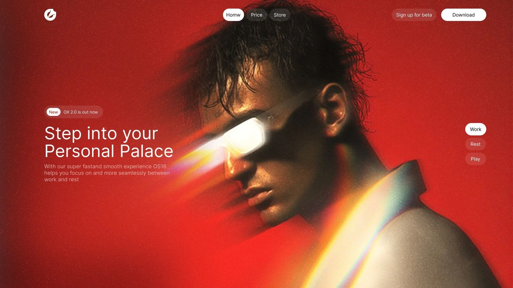
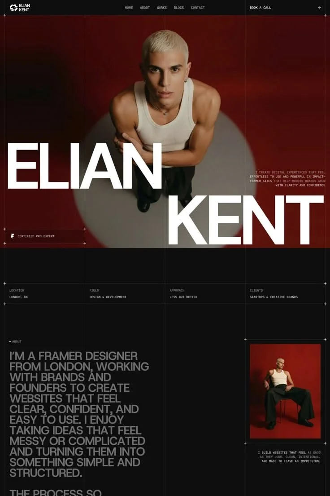
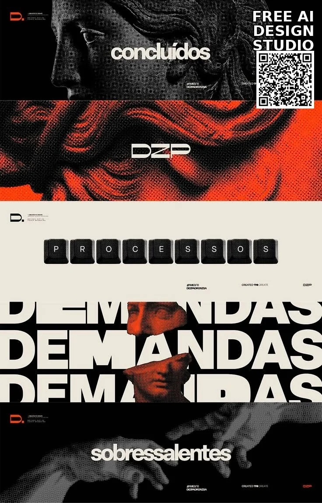
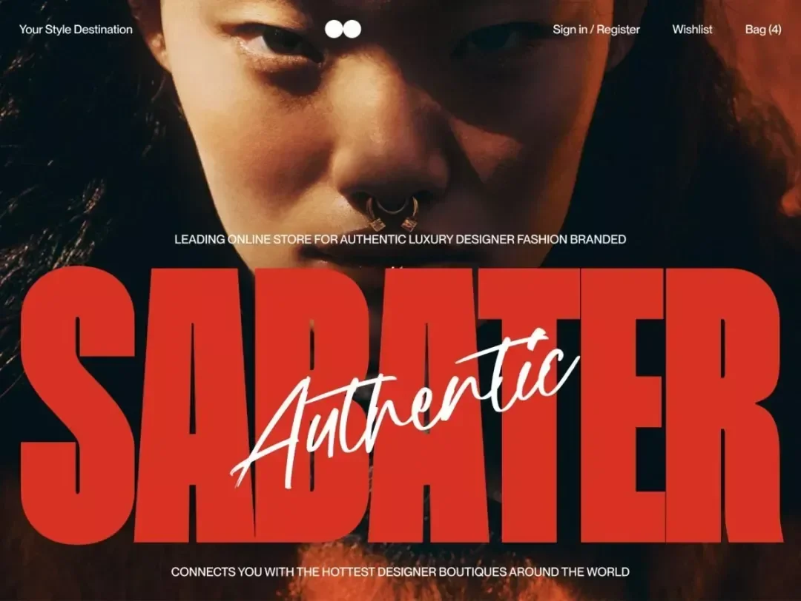
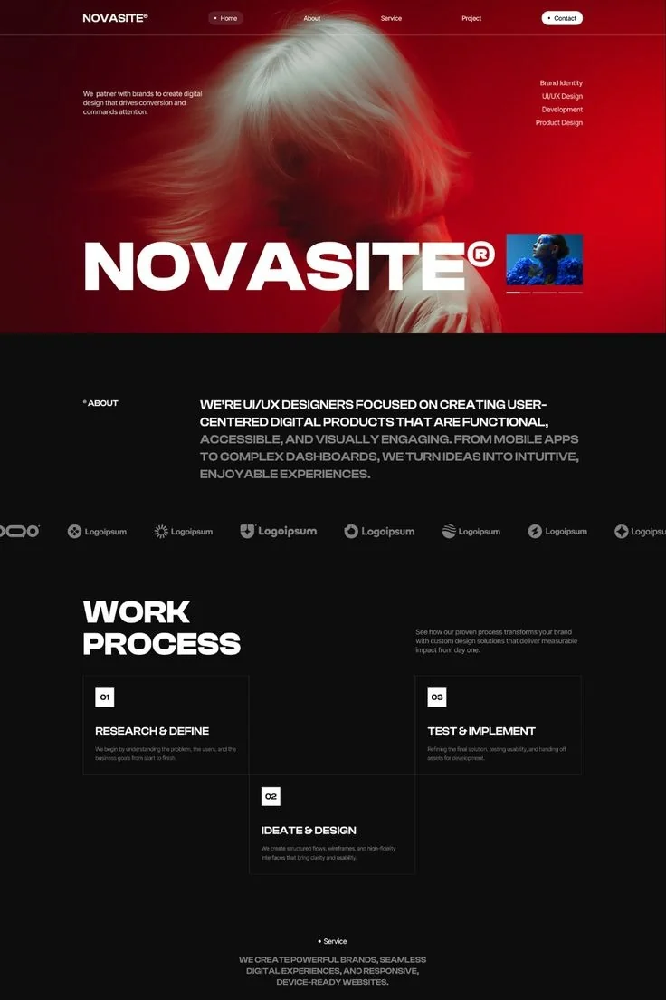
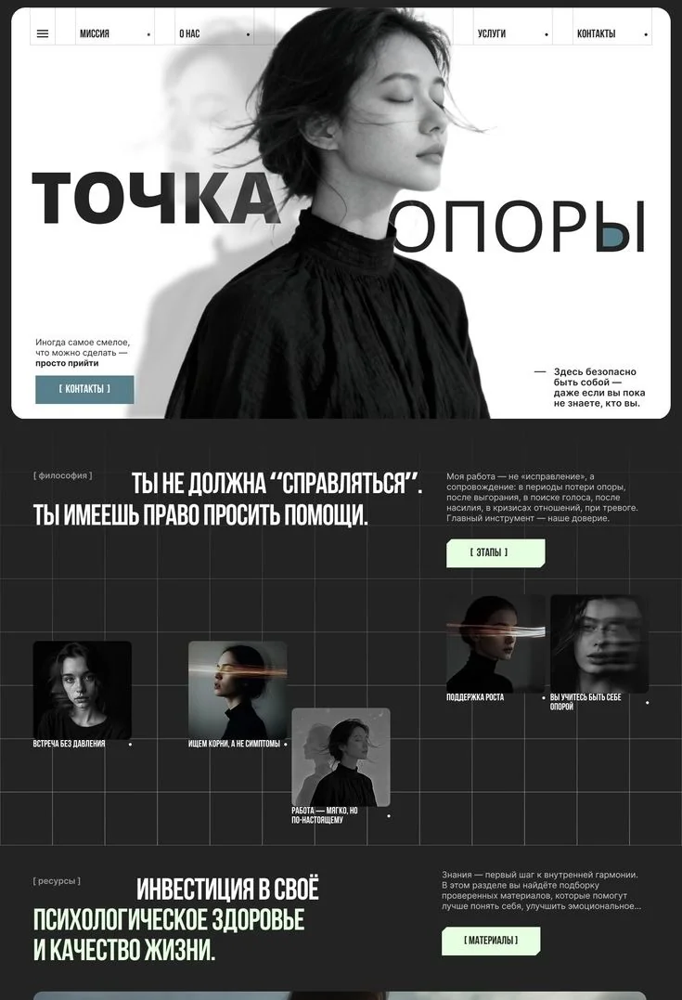
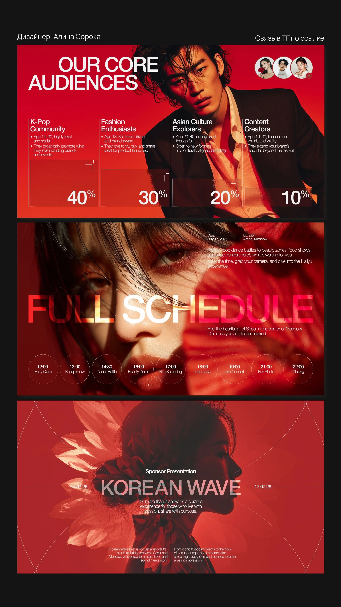
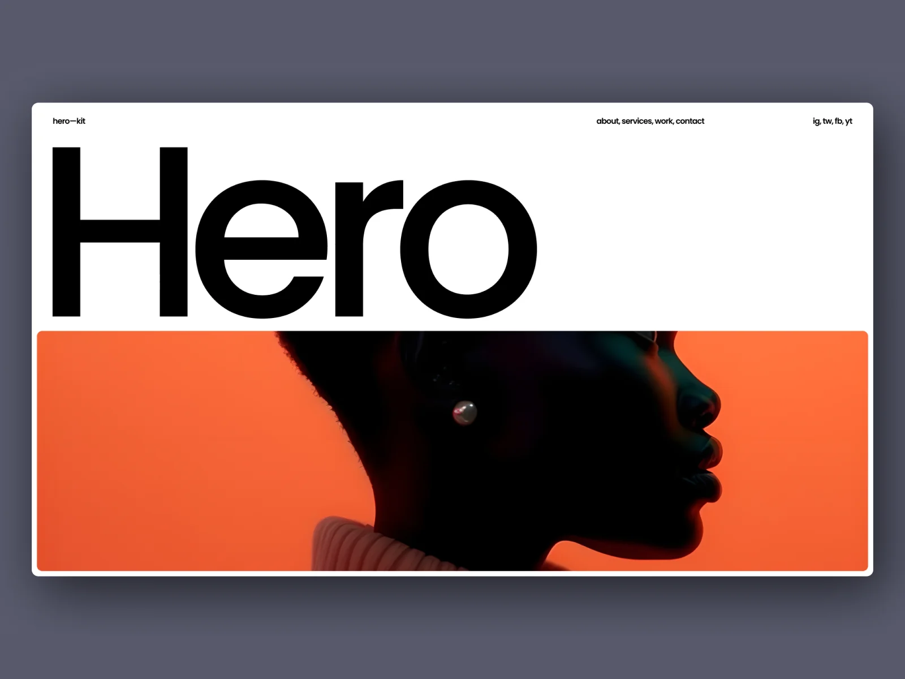
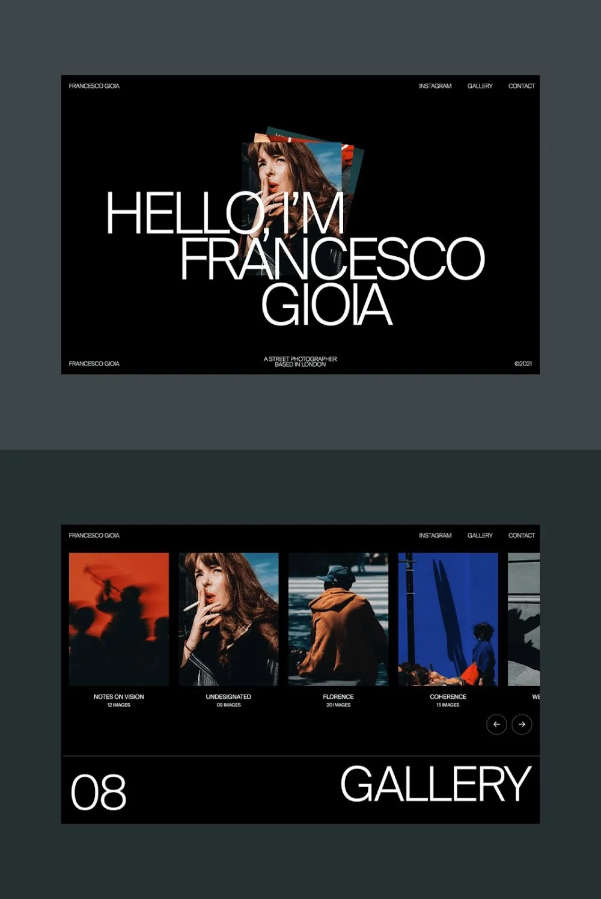

# Premium Section Benchmarks & Visual References

A visual catalogue and implementation guide for AI agents crafting high-end, award-winning web sections. Every AI agent should reference these 9 benchmarks to understand how top-tier web applications structure sections, execute signature components, and scale viewport heights on Desktop (`100vh`–`140vh`) while maintaining fluid responsiveness on mobile.

---

## Visual Benchmark Index

| Benchmark File | Archetype | Target Viewport Height | Primary Use Case |
| :--- | :--- | :--- | :--- |
| [`section-hero-futuristic-os.webp`](../resources/design-references/section-hero-futuristic-os.webp) | Futuristic Personal OS Hero | `100vh` (Desktop) / `100svh` (Mobile) | Next-gen SaaS, AI interfaces, hardware products |
| [`section-portfolio-editorial-grid.webp`](../resources/design-references/section-portfolio-editorial-grid.webp) | Editorial Architectural Grid | `130vh`–`140vh` (Desktop) / `auto` (Mobile) | Creative agency, executive portfolio, high-fashion |
| [`section-brutalist-kinetic-type.webp`](../resources/design-references/section-brutalist-kinetic-type.webp) | Brutalist Halftone & Kinetic Type | `120vh`–`130vh` (Desktop) / `auto` (Mobile) | Design studios, streetwear, experimental tech |
| [`section-hero-luxury-fashion.webp`](../resources/design-references/section-hero-luxury-fashion.webp) | Luxury Headline & Hero Overlay | `100vh` (Desktop) / `100svh` (Mobile) | E-commerce hero, brand launches, lifestyle platforms |
| [`section-process-stepped-cards.webp`](../resources/design-references/section-process-stepped-cards.webp) | Stepped Bento Process Flow | `130vh` (Desktop) / `auto` (Mobile) | Agency workflows, SaaS feature onboarding |
| [`section-editorial-wireframe-matrix.webp`](../resources/design-references/section-editorial-wireframe-matrix.webp) | Wireframe Grid & Minimalist Staging | `120vh`–`140vh` (Desktop) / `auto` (Mobile) | Editorial blogs, medical/wellness, boutique advisory |
| [`section-metrics-timeline-multistage.webp`](../resources/design-references/section-metrics-timeline-multistage.webp) | Multi-Stage Metrics & Timeline Deck | `140vh` (Desktop) / `auto` (Mobile) | Event landing pages, pitch decks, investor metrics |
| [`section-hero-swiss-minimalism.webp`](../resources/design-references/section-hero-swiss-minimalism.webp) | Swiss International Split Stage | `100vh` (Desktop) / `100svh` (Mobile) | Design kits, design systems, modern portfolios |
| [`section-gallery-horizontal-carousel.webp`](../resources/design-references/section-gallery-horizontal-carousel.webp) | Layered Cards & Horizontal Gallery | `120vh`–`130vh` (Desktop) / `auto` (Mobile) | Creative work showcases, product galleries |

---

## 1. Futuristic Personal OS Hero (`section-hero-futuristic-os.webp`)

- **Target Height**: `min-height: 100vh` (PC) • `min-height: 100svh` (Mobile)
- **Signature Component**: Floating glassmorphic mode-switcher badge ("Work", "Rest", "Play") paired with high-contrast headline ("Step into your Personal Palace") and crimson luminous lighting.
- **Key Design Patterns**:
  - Semi-transparent pill tags (`rgba(255, 255, 255, 0.1)`) with `backdrop-filter: blur(12px)`.
  - Minimal sharp roundness on primary CTA (`border-radius: 6px`).
  - Subtle floating status pill ("New: OX 2.0 is out now").
- **Agent Instruction**: Use this reference when the user asks for a cutting-edge AI, gaming, or futuristic SaaS hero section with high emotional impact.

---

## 2. Editorial Architectural Grid (`section-portfolio-editorial-grid.webp`)

- **Target Height**: `min-height: 130vh` to `140vh` (PC) • `min-height: auto` (Mobile)
- **Signature Component**: Massive display typography layer ("ELIAN KENT") intersecting a central model cutout, surrounded by an architectural crosshair coordinate grid (`+` marks) and a structured 4-column metadata specification bar (Location, Field, Approach, Clients).
- **Key Design Patterns**:
  - 1px hairline border grid with coordinate markers.
  - Generous vertical breathing room (`padding: 120px 0`).
  - Staggered storytelling bio card in lower quadrant with contrasting accent frame.
- **Agent Instruction**: Use this pattern when building high-end creative agency portfolios, architecture firms, or luxury consultancy homepages.

---

## 3. Brutalist Halftone & Kinetic Typography (`section-brutalist-kinetic-type.webp`)

- **Target Height**: `min-height: 120vh` to `130vh` (PC) • `min-height: auto` (Mobile)
- **Signature Component**: High-contrast halftone textures mixed with 3D mechanical keyboard keycaps ("PROCESSOS") and rhythmic condensed kinetic typography repetition ("DEMANDAS").
- **Key Design Patterns**:
  - High-contrast black, cream, and vermilion red color palette.
  - Tactile 3D skeuomorphic keycaps centered within an architectural sans-serif frame.
  - QR Code scanner widget and minimalist studio badge metadata.
- **Agent Instruction**: Reference this design when the user seeks an edgy, experimental, design-studio, or creative brand identity.

---

## 4. Luxury E-Commerce Headline Overlay (`section-hero-luxury-fashion.webp`)

- **Target Height**: `min-height: 100vh` (PC) • `min-height: 100svh` (Mobile)
- **Signature Component**: Ultra-condensed bold red block typography ("SABATER") layered behind a contrasting cursive script accent ("Authentic"), sitting on top of full-bleed editorial photography.
- **Key Design Patterns**:
  - Top minimal utility bar (`font-size: 0.85rem`, `font-weight: 500`) with quick cart count and authentication.
  - Centered geometric navigation dot indicator.
  - Zero gradient washes; typography relies entirely on pure color contrast and photographic depth.
- **Agent Instruction**: Use when creating fashion, high-end consumer goods, or modern retail web applications.

---

## 5. Stepped Bento Process Flow (`section-process-stepped-cards.webp`)

- **Target Height**: `min-height: 130vh` (PC) • `min-height: auto` (Mobile)
- **Signature Component**: Stepped diagonal workflow cards (`01 RESEARCH & DEFINE`, `02 IDEATE & DESIGN`, `03 TEST & IMPLEMENT`) cascading across the viewport with client logo ticker marquee.
- **Key Design Patterns**:
  - Dark obsidian background (`#0a0a0c`) with solid card fills (`#111216`) and 1px borders (`rgba(255, 255, 255, 0.08)`).
  - Number badge indicator (`border-radius: 4px`) at the top-left of each step.
  - High-impact brand logo ("NOVASITE®") with subtle thumbnail gallery integration.
- **Agent Instruction**: Use this pattern for SaaS workflow explanations, onboarding overviews, and technical service agency walkthroughs.

---

## 6. Minimalist Wireframe Grid & Staged Content (`section-editorial-wireframe-matrix.webp`)

- **Target Height**: `min-height: 120vh` to `140vh` (PC) • `min-height: auto` (Mobile)
- **Signature Component**: Monochromatic editorial wireframe grid with floating portrait cards, bracketed micro-tags (`[ ФИЛОСОФИЯ ]`, `[ ЭТАПЫ ]`, `[ МАТЕРИАЛЫ ]`), and high-contrast typographic hierarchy.
- **Key Design Patterns**:
  - Subtle grid overlay (`rgba(255, 255, 255, 0.04)`) creating architectural symmetry.
  - Minimal pill buttons with brackets (`[ КОНТАКТЫ ]`).
  - Asymmetric placement of card imagery anchored to grid intersections.
- **Agent Instruction**: Ideal for editorial websites, healthcare/wellness platforms, legal counsel, or minimalist publications.

---

## 7. Multi-Stage Metrics, Schedule & Timeline Deck (`section-metrics-timeline-multistage.webp`)

- **Target Height**: `min-height: 140vh` (PC) • `min-height: auto` (Mobile)
- **Signature Component**: Triple-stage visual deck featuring:
  1. Audience demographic metric cards (`40%`, `30%`, `20%`, `10%`) with clean hairline charts.
  2. Horizontal interactive schedule timeline with pill nodes (`12:00` through `22:00`).
  3. Circular geometric sponsor presentation stage with date markers.
- **Key Design Patterns**:
  - Deep crimson and black high-contrast palette.
  - Horizontal timeline scrubbers that stack cleanly on mobile devices.
  - Integrated circular avatar cluster for speaker/team rosters.
- **Agent Instruction**: Reference this design for event landing pages, conference schedules, tokenomics/investor decks, and multi-metric analytics presentations.

---

## 8. Swiss International Split Stage (`section-hero-swiss-minimalism.webp`)

- **Target Height**: `min-height: 100vh` (PC) • `min-height: 100svh` (Mobile)
- **Signature Component**: Stark, minimalist 50/50 vertical split: monumental black grotesque typography ("Hero") on crisp studio white upper half, contrasting with a rounded warm burnt-orange photography container below.
- **Key Design Patterns**:
  - Extreme typographic hierarchy and intentional whitespace.
  - Subtle rounded container corners (`border-radius: 12px`).
  - Top header tracking with lower-case branding (`hero—kit`).
- **Agent Instruction**: Perfect for modern design tool landing pages, developer kits, portfolio showcases, and design system documentation.

---

## 9. Layered Cards & Horizontal Gallery Carousel (`section-gallery-horizontal-carousel.webp`)

- **Target Height**: `min-height: 120vh` to `130vh` (PC) • `min-height: auto` (Mobile)
- **Signature Component**: Dark mode portfolio hero with 3D layered tilt cards behind bold display typography, transitioning smoothly into a horizontal multi-card photo strip with directional arrow controls (`←` `→`).
- **Key Design Patterns**:
  - Layered card fan-out on hover/interaction.
  - Numbered section prefix (`08 GALLERY`) with clean sans-serif typography.
  - Card metadata caption underneath each thumbnail (`NOTES ON VISION / 12 IMAGES`).
- **Agent Instruction**: Use when designing creator portfolios, photo galleries, case study index carousels, or customer story showcases.

---

## Summary Checklist for AI Agents

When building web sections, always match your work against these benchmarks:
- [ ] **Section Scope**: Is the section structured as a complete, self-contained visual experience?
- [ ] **Signature Component**: Does this section include a distinct, high-craft interactive component (not just text bullets)?
- [ ] **Desktop Height**: Does it utilize deliberate vertical scale (`100vh`–`140vh`) on PC so elements breathe?
- [ ] **Mobile Fluidity**: Does it gracefully adapt to `min-height: auto` on phone screens with stacked layouts and zero scroll trapping?
- [ ] **Aesthetic Integrity**: Does it maintain solid high-contrast colors, clean typography (`Plus Jakarta Sans`, `Manrope`, `Inter`), and sharp corners (`6px`–`8px` CTAs)?
